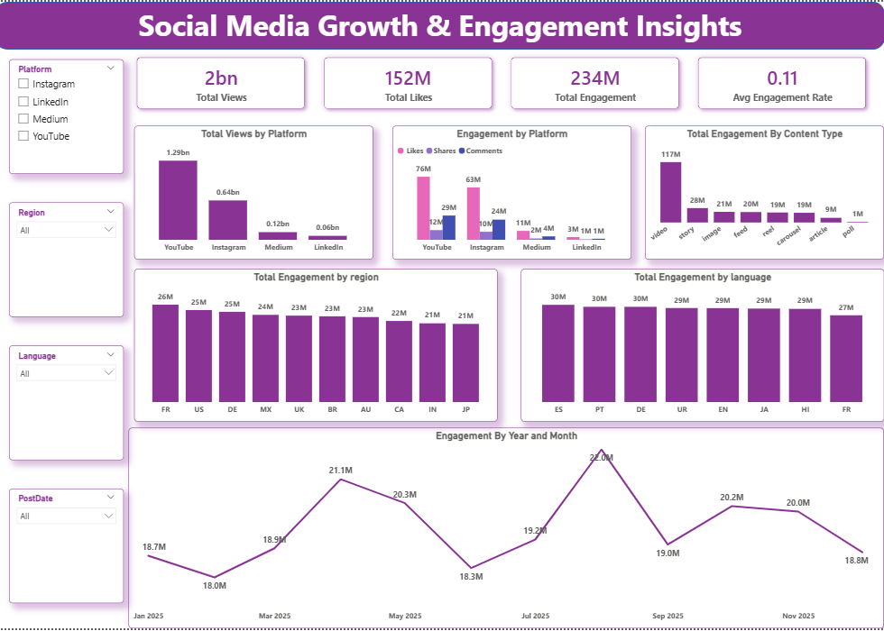

# 📊 Social Media Growth & Engagement Insights

## 🚀 Project Overview
This project presents an end-to-end social media analytics solution to analyze user engagement and content performance across platforms such as YouTube, Instagram, LinkedIn, and Medium.

Using a dataset of **10,000+ social media posts**, the project combines **Python for data processing**, **SQL for validation and querying, and Power BI for interactive dashboard creation** to extract actionable insights on engagement trends, platform performance, and content effectiveness.

---

## 📂 Dataset Information
- 📌 Total Records: 10,000+
- 🧾 Dataset Type: Social Media Performance Dataset  
- 🧩 Key Features:
  - Likes, Comments, Shares  
  - Platform (YouTube, Instagram, LinkedIn, etc.)  
  - Content Type (Video, Image, Text, Reel)  
  - Posting Date  
  - Region-wise engagement  
  - Engagement metrics  

---

## 🛠️ Tools & Technologies
- Python (Pandas, NumPy, Matplotlib)  
- MySQL (SQL Queries & Validation)  
- Power BI (Dashboard Development)  
- DAX (KPIs & Measures)  
- Excel  

---

## ❓ Key Business Questions
- Which platform drives the highest engagement?
- Which content type performs best?
- How does posting time impact engagement?
- Which regions show maximum interaction?
- What are the overall engagement trends?

---

## 📊 Analysis Workflow

### Data Cleaning & Preparation
- Cleaned dataset using Python (Pandas)
- Handled missing values and duplicates
- Created KPI: Total Engagement = Likes + Comments + Shares

### Exploratory Data Analysis (EDA)
- Platform-wise engagement comparison
- Content type analysis
- Top-performing posts identification
- Engagement trend analysis

### SQL Analysis
- Platform ranking queries
- Top posts extraction
- Aggregate engagement analysis
- Trend-based SQL queries

### Power BI Dashboard
- Interactive dashboard with slicers and filters
- KPI cards using DAX
- Drill-down analysis for insights
- Visualized platform and content performance

---

## 📌 Key KPIs
- Total Engagement  
- Average Engagement Rate  
- Platform Performance  
- Content Type Performance  
- Engagement Trends  
- Regional Distribution  

---

## 📁 Project Files
- social_media_analysis_data.csv  
- social_media_growth_insights.ipynb  
- social_media_queries.sql  
- social_media_dashboard.pbix  
- dashboard_preview.png  

---

## 📸 Dashboard Preview

  

---

## 🧠 Skills Demonstrated
- Data Cleaning & Preprocessing  
- Exploratory Data Analysis (EDA)  
- SQL Querying & Validation  
- Data Visualization  
- Power BI Dashboard Development  
- KPI Design (DAX)  
- Business Intelligence  

---

## 👨‍💻 Author
**Aditya Sakhuja**

LinkedIn: https://www.linkedin.com/in/aditya-sakhuja-508b33274/  
GitHub: https://github.com/AdityaSakhuja18  

---

## ⭐ Project Impact
This project demonstrates an end-to-end analytics pipeline that transforms raw social media data into actionable business insights using Python, SQL, and Power BI.
